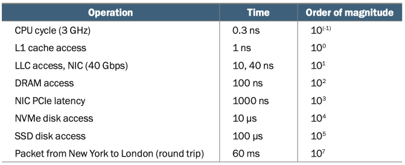

# Latency

## Chapter 1

### Definition

- Latency is a performance metric that measures time delay in your system.
- Latency is the time delay between a cause and its observed effect.
- e.g. smart lightbulb: pressing the button to turn on the lights sent a message over the wireless network from the phone to a controller hub and then over a Bluetooth, to the light bulb itself.
- e.g. HTTP request: URL -> domain name system (DNS) lookup (local cache or a query to a remote DNS server) -> domain IP address -> data fetch -> external service (backend) -> database -> HTTP response -> browser page rendering
- [Comment] This is why it's important to undertand how the entire system works
  - See which parts of the system lifecycle has the bottleneck
  - Traces are especially useful in this context because they measure each component latency for the entire lifecycle

### How is latency measured?

- Understand orders of magnitude of latency
- Round-trip network latency from New York to London is 60 milliseconds (ms)
- Additional resource: [Napkin Math: Estimating System Performance](https://www.youtube.com/watch?v=IxkSlnrRFqc&t=1s)

### Why does latency matter?

- User experience
  - High latency: users abandon slower services, convert at lower rates, and engage less frequently
  - Low latency: correlation with economic performance
  - Akamai report stated that a 100-millisecond latency increase for a website to load could result in a 7% decrease in conversion rates.
  - Google reported in 2006 that a 1-second increase in delay reduces engagement by 20%
  - The Akamai report states that with a load time of over 3 seconds, half of users essentially abandon your site

### Latency vs Throughput

- Latency: how quickly *one* task is executed? (time it takes)
- Throughput: how many tasks can be executed? (rate of production, quantity of tasks done)
  - Commonly related to bandwidth
  - Network Wi-Fi with a bandwidth of 54 megabits per second (Mbps): it means you can move data over the network at a (theorical maximum) rate of 6.75 megabytes per second (MB/s)
- The example of washing clothes has this trade-off: do we want a quick washing/dying task (latency) or more loads of clothes washed/dyned (throughput)?
